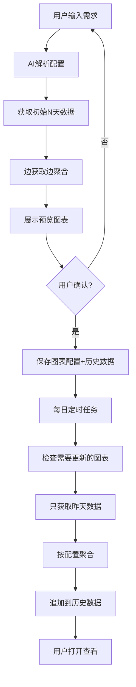

# 图表持久化与增量更新技术方案

## 1. 背景与问题

### 1.1 当前痛点
- **数据量大**：查询10天数据 = 10次API调用 × 每次3万条 = 30万条数据
- **处理慢**：前端处理30万条数据需要5-10秒，可能导致浏览器卡顿
- **重复查询**：用户每次打开都要重新获取和处理数据
- **内存压力**：30万条数据占用大量内存，尤其双埋点关联计算

### 1.2 核心需求
1. **图表保存**：用户通过AI生成图表后，可以保存配置
2. **增量更新**：每天只更新昨天的数据，不重复处理历史数据
3. **无限期保留**：历史数据持续累积，支持长期趋势分析
4. **定时任务**：自动更新，无需用户手动触发

---

## 2. 架构设计

### 2.1 核心理念

**从"临时查询工具"转变为"图表订阅系统"**

```
旧模式：
用户需求 → 获取30万条 → 处理 → 展示 → 关闭页面（数据丢失）

新模式：
用户需求 → AI生成配置 → 获取初始数据（一次性）→ 保存图表
         ↓
每天增量：只获取昨天3万条 → 聚合为1-10条 → 追加到历史数据
         ↓
用户打开：直接读取聚合数据（秒开）
```

### 2.2 数据流



---

## 3. 数据存储设计

### 3.1 IndexedDB 数据库结构

#### 数据库名称
```
yeepay_charts_db
版本：1
```

#### ObjectStore 1: charts（图表配置表）

```javascript
{
  // 主键
  id: "chart_20251011_001",
  
  // 基础信息
  name: "支付页面UV/PV趋势",
  description: "支付页面最近30天的访问趋势",
  category: "页面分析", // 页面分析 | 用户行为 | 转化分析 | 全局概览
  
  // AI生成的配置
  config: {
    chartType: "line", // line | bar | pie | funnel | value_card
    
    // 数据源配置
    dataSource: {
      mode: "single", // single | dual
      projectId: "123",
      selectedPointId: "456",
      埋点类型: "访问" // 访问 | 点击
    },
    
    // 过滤条件
    filters: {
      pageName: "支付页面", // 单页面分析
      pageNames: ["页面A", "页面B"], // 多页面对比（可选）
      // 未来可扩展更多过滤条件
    },
    
    // 分析维度
    dimensions: ["date"], // date | hour | page | user_type
    
    // 分析指标
    metrics: ["uv", "pv"], // uv | pv | duration | bounce_rate
    
    // 日期范围策略
    dateRangeStrategy: "last_30_days", // last_7_days | last_30_days | last_90_days | custom
    customDateRange: null // 如果是custom，这里存具体范围
  },
  
  // 更新策略
  updateStrategy: {
    enabled: true,
    frequency: "daily", // daily | manual
    updateTime: "01:00", // 更新时间（CS架构才生效）
    autoUpdate: true
  },
  
  // 状态
  status: "active", // active | paused | archived
  
  // 时间戳
  createdAt: "2025-10-11T10:00:00Z",
  updatedAt: "2025-10-11T10:00:00Z",
  lastDataUpdate: "2025-10-11T01:00:00Z"
}
```

**索引**：
- `id`（主键）
- `status`（查询激活的图表）
- `category`（按分类查询）
- `createdAt`（按创建时间排序）

---

#### ObjectStore 2: chart_data（聚合数据表）

```javascript
{
  // 复合主键
  id: "chart_20251011_001_2025-10-11",
  
  // 关联信息
  chartId: "chart_20251011_001",
  date: "2025-10-11", // 数据日期
  
  // 聚合后的指标数据（轻量）
  metrics: {
    uv: 2000,
    pv: 10000,
    avgDuration: 120,
    bounceRate: 0.35
  },
  
  // 维度数据（如果有多维度分析）
  dimensions: {
    // 按页面分组（多页面对比时）
    byPage: {
      "页面A": { uv: 1000, pv: 5000 },
      "页面B": { uv: 1000, pv: 5000 }
    },
    
    // 按小时分组（单天明细时）
    byHour: {
      "00": { uv: 50, pv: 200 },
      "01": { uv: 45, pv: 180 },
      // ...
    }
  },
  
  // 可选：保留少量样本数据（用于下钻分析）
  samples: [
    { id: "xxx", pageName: "支付页面", createdAt: "...", ... },
    // ... 最多10条
  ],
  
  // 元数据
  metadata: {
    rawRecordCount: 30000, // 原始数据条数
    processedAt: "2025-10-12T01:05:23Z", // 处理时间
    dataQuality: "good", // good | partial | failed
    errorMessage: null
  }
}
```

**索引**：
- `id`（主键）
- `chartId`（查询某个图表的所有数据）
- `chartId + date`（复合索引，快速查询）
- `date`（按日期查询）

---

#### ObjectStore 3: raw_data_cache（原始数据缓存，可选）

```javascript
{
  // 主键
  id: "raw_2025-10-11_project_123_point_456",
  
  // 基础信息
  date: "2025-10-11",
  projectId: "123",
  selectedPointId: "456",
  
  // 分块存储（避免单条记录过大）
  chunks: [
    {
      chunkId: 1,
      pageRange: 1, // 第1页数据（API分页）
      recordCount: 1000,
      data: [...1000条原始数据]
    },
    // ... 30个chunks
  ],
  
  // 快速索引
  index: {
    totalRecords: 30000,
    pages: ["首页", "支付页", "商品页", ...],
    dateRange: ["2025-10-11 00:00:00", "2025-10-11 23:59:59"]
  },
  
  // 过期时间
  createdAt: "2025-10-11T10:00:00Z",
  expiresAt: "2025-10-14T10:00:00Z" // 3天后过期
}
```

**用途**：
- 缓存最近3天的原始数据
- 当用户修改图表配置时，可以直接从缓存重新聚合，不需要重新调用API
- 超过3天自动清理，节省空间

**索引**：
- `id`（主键）
- `date + projectId`（复合索引）
- `expiresAt`（清理过期数据）

---

### 3.2 存储空间估算

| 数据类型 | 单条大小 | 数量 | 总大小 |
|---------|---------|------|--------|
| 图表配置 | ~2KB | 50个图表 | ~100KB |
| 聚合数据（单图表30天） | ~1KB/天 | 50图表×30天 | ~1.5MB |
| 聚合数据（单图表365天） | ~1KB/天 | 50图表×365天 | ~18MB |
| 原始数据缓存（3天） | ~60MB/天 | 3天 | ~180MB |
| **总计（含缓存）** | | | **~200MB** |
| **总计（不含缓存）** | | | **~20MB** |

**结论**：即使50个图表保留1年数据，也只占用约20MB，完全可行。

---

## 4. 聚合策略

### 4.1 按图表类型聚合

#### 趋势图（line）- 按天聚合

```javascript
输入：3万条原始数据（某一天）
过滤：只保留指定页面的数据 → 可能剩余1000-5000条
聚合：
  {
    date: "2025-10-11",
    uv: new Set(filtered.map(d => d.weCustomerKey)).size,
    pv: filtered.length
  }
输出：1条聚合数据
```

#### 柱状图（bar）- 按页面聚合

```javascript
输入：3万条原始数据（某一天）
聚合：按页面分组
  [
    { page: "首页", uv: 2000, pv: 10000 },
    { page: "支付页", uv: 1500, pv: 8000 },
    { page: "商品页", uv: 1000, pv: 6000 },
    ...
  ]
输出：约5-15条聚合数据（取决于页面数量）
```

#### 饼图（pie）- 按类型聚合

```javascript
输入：3万条原始数据
聚合：按type或其他分类维度
  [
    { name: "类型A", value: 15000 },
    { name: "类型B", value: 10000 },
    { name: "类型C", value: 5000 }
  ]
输出：3-8条聚合数据
```

### 4.2 UV精确计算方案

#### 问题
跨天UV去重：
```
Day1: 用户集合 = [user1, user2, ..., user5000]
Day2: 用户集合 = [user2000, user2001, ..., user7000]
合并: 需要去重计算总UV
```

如果直接存储用户ID集合，30天可能需要存储数十万个ID。

#### 方案A：HyperLogLog算法（推荐）

```javascript
import HyperLogLog from 'hyperloglog'

// 每天存储HyperLogLog对象（序列化后约1KB）
{
  date: "2025-10-11",
  metrics: {
    pv: 10000,
    uvHLL: "base64_encoded_hll_data...", // 约1KB
    uvEstimate: 2000 // ±2%误差
  }
}

// 查询30天总UV
const hlls = data.map(d => HyperLogLog.fromBase64(d.metrics.uvHLL))
const merged = HyperLogLog.merge(hlls)
const totalUV = merged.count() // 准确率 > 98%
```

**优点**：
- 存储小（1KB vs 数MB）
- 合并快（毫秒级）
- 准确率高（误差<2%）

#### 方案B：精确存储（备选）

```javascript
// 存储实际用户ID（仅用于需要精确计算的场景）
{
  date: "2025-10-11",
  metrics: {
    pv: 10000,
    uv: 2000,
    uvSet: ["user1", "user2", ..., "user2000"] // 约40KB
  }
}
```

**适用场景**：
- 图表需要100%精确的UV
- 数据量不大（单天UV < 1万）

**建议**：默认使用HyperLogLog，对于特殊需求可选精确存储

---

## 5. 增量更新机制

### 5.1 更新触发时机

#### Web环境（本次实施）
```javascript
// 用户打开应用时检查
App.vue onMounted() {
  await checkAndUpdateCharts()
}

async function checkAndUpdateCharts() {
  const charts = await db.getAllActiveCharts()
  const yesterday = dayjs().subtract(1, 'day').format('YYYY-MM-DD')
  
  for (const chart of charts) {
    // 检查昨天的数据是否已更新
    const hasYesterdayData = await db.hasChartData(chart.id, yesterday)
    
    if (!hasYesterdayData) {
      console.log(`图表 ${chart.name} 需要更新`)
      await updateChartForDate(chart, yesterday)
    }
  }
}
```

#### CS环境（将来迁移）
```javascript
// Electron或Tauri中使用node-cron
const cron = require('node-cron')

// 每天凌晨1点执行
cron.schedule('0 1 * * *', async () => {
  console.log('开始每日图表更新任务')
  await updateAllCharts()
})
```

### 5.2 更新流程

```javascript
async function updateChartForDate(chart, date) {
  try {
    // 1. 获取该日期的原始数据
    console.log(`获取 ${date} 的数据...`)
    const rawData = await fetchDayData({
      date,
      projectId: chart.config.dataSource.projectId,
      selectedPointId: chart.config.dataSource.selectedPointId
    }) // 3万条
    
    // 2. 根据图表配置进行聚合
    console.log(`聚合数据（${rawData.length}条）...`)
    const aggregated = aggregateForChart(rawData, chart.config)
    // 3万条 → 1-10条
    
    // 3. 保存到数据库
    await db.saveChartData({
      chartId: chart.id,
      date: date,
      metrics: aggregated.metrics,
      dimensions: aggregated.dimensions,
      metadata: {
        rawRecordCount: rawData.length,
        processedAt: new Date().toISOString(),
        dataQuality: 'good'
      }
    })
    
    // 4. 更新图表的lastDataUpdate时间
    await db.updateChart(chart.id, {
      lastDataUpdate: new Date().toISOString()
    })
    
    console.log(`图表 ${chart.name} 更新成功`)
    
  } catch (error) {
    console.error(`图表 ${chart.name} 更新失败:`, error)
    
    // 记录失败信息
    await db.saveChartData({
      chartId: chart.id,
      date: date,
      metadata: {
        dataQuality: 'failed',
        errorMessage: error.message
      }
    })
  }
}
```

### 5.3 批量更新优化

```javascript
async function updateAllCharts() {
  const charts = await db.getAllActiveCharts()
  const yesterday = dayjs().subtract(1, 'day').format('YYYY-MM-DD')
  
  // 按项目分组（相同项目的图表可以共享原始数据）
  const chartsByProject = groupBy(charts, c => c.config.dataSource.projectId)
  
  for (const [projectId, projectCharts] of Object.entries(chartsByProject)) {
    // 只获取一次原始数据
    const rawData = await fetchDayData({
      date: yesterday,
      projectId: projectId,
      selectedPointId: projectCharts[0].config.dataSource.selectedPointId
    })
    
    // 为每个图表聚合
    for (const chart of projectCharts) {
      const aggregated = aggregateForChart(rawData, chart.config)
      await db.saveChartData({ chartId: chart.id, date: yesterday, ...aggregated })
    }
  }
}
```

**优化点**：
- 相同项目的图表共享原始数据
- 只调用一次API，减少网络请求
- 10个图表可能只需要2-3次API调用

---

## 6. 核心功能模块

### 6.1 IndexedDB 封装（utils/indexedDBManager.js）

```javascript
class ChartDatabase {
  constructor() {
    this.db = null
    this.dbName = 'yeepay_charts_db'
    this.version = 1
  }
  
  async init() {
    return new Promise((resolve, reject) => {
      const request = indexedDB.open(this.dbName, this.version)
      
      request.onerror = () => reject(request.error)
      request.onsuccess = () => {
        this.db = request.result
        resolve()
      }
      
      request.onupgradeneeded = (event) => {
        const db = event.target.result
        
        // 创建图表配置表
        if (!db.objectStoreNames.contains('charts')) {
          const chartStore = db.createObjectStore('charts', { keyPath: 'id' })
          chartStore.createIndex('status', 'status', { unique: false })
          chartStore.createIndex('category', 'category', { unique: false })
          chartStore.createIndex('createdAt', 'createdAt', { unique: false })
        }
        
        // 创建聚合数据表
        if (!db.objectStoreNames.contains('chart_data')) {
          const dataStore = db.createObjectStore('chart_data', { keyPath: 'id' })
          dataStore.createIndex('chartId', 'chartId', { unique: false })
          dataStore.createIndex('date', 'date', { unique: false })
          dataStore.createIndex('chartId_date', ['chartId', 'date'], { unique: true })
        }
        
        // 创建原始数据缓存表
        if (!db.objectStoreNames.contains('raw_data_cache')) {
          const cacheStore = db.createObjectStore('raw_data_cache', { keyPath: 'id' })
          cacheStore.createIndex('date', 'date', { unique: false })
          cacheStore.createIndex('expiresAt', 'expiresAt', { unique: false })
        }
      }
    })
  }
  
  // CRUD 方法...
  async saveChart(chart) { ... }
  async getChart(id) { ... }
  async getAllCharts(filter) { ... }
  async updateChart(id, updates) { ... }
  async deleteChart(id) { ... }
  
  async saveChartData(data) { ... }
  async getChartData(chartId, dateRange) { ... }
  async hasChartData(chartId, date) { ... }
  
  // 清理方法
  async cleanExpiredCache() { ... }
}

export const chartDB = new ChartDatabase()
```

### 6.2 聚合服务（utils/aggregationService.js）

```javascript
class AggregationService {
  /**
   * 根据图表配置聚合数据
   */
  aggregateForChart(rawData, chartConfig) {
    const { chartType, filters, metrics, dimensions } = chartConfig
    
    // 1. 应用过滤条件
    let filtered = this.applyFilters(rawData, filters)
    
    // 2. 根据图表类型聚合
    switch (chartType) {
      case 'line':
        return this.aggregateForLine(filtered, metrics)
      case 'bar':
        return this.aggregateForBar(filtered, metrics, dimensions)
      case 'pie':
        return this.aggregateForPie(filtered, metrics)
      // ...
    }
  }
  
  applyFilters(data, filters) {
    let result = data
    
    if (filters.pageName) {
      result = result.filter(d => d.pageName === filters.pageName)
    }
    
    if (filters.pageNames && filters.pageNames.length > 0) {
      result = result.filter(d => filters.pageNames.includes(d.pageName))
    }
    
    return result
  }
  
  aggregateForLine(data, metrics) {
    const uvSet = new Set()
    let pv = 0
    
    data.forEach(item => {
      if (item.weCustomerKey) uvSet.add(item.weCustomerKey)
      pv++
    })
    
    return {
      metrics: {
        uv: uvSet.size,
        pv: pv
      }
    }
  }
  
  aggregateForBar(data, metrics, dimensions) {
    // 按页面分组
    const pageMap = {}
    
    data.forEach(item => {
      const page = item.pageName || '未知页面'
      if (!pageMap[page]) {
        pageMap[page] = { uvSet: new Set(), pv: 0 }
      }
      pageMap[page].uvSet.add(item.weCustomerKey)
      pageMap[page].pv++
    })
    
    return {
      dimensions: {
        byPage: Object.entries(pageMap).map(([page, stats]) => ({
          page,
          uv: stats.uvSet.size,
          pv: stats.pv
        }))
      }
    }
  }
}

export const aggregationService = new AggregationService()
```

### 6.3 图表管理服务（composables/useChartManager.js）

```javascript
export function useChartManager() {
  const savedCharts = ref([])
  
  // 初始化
  const init = async () => {
    await chartDB.init()
    await loadCharts()
    await checkAndUpdate()
  }
  
  // 加载所有图表
  const loadCharts = async () => {
    savedCharts.value = await chartDB.getAllCharts({ status: 'active' })
  }
  
  // 保存新图表
  const saveChart = async (chartConfig, initialData) => {
    const chart = {
      id: `chart_${Date.now()}`,
      ...chartConfig,
      status: 'active',
      createdAt: new Date().toISOString(),
      updatedAt: new Date().toISOString()
    }
    
    await chartDB.saveChart(chart)
    
    // 保存初始数据
    for (const [date, data] of Object.entries(initialData)) {
      await chartDB.saveChartData({
        chartId: chart.id,
        date: date,
        ...data
      })
    }
    
    await loadCharts()
    return chart
  }
  
  // 检查并更新
  const checkAndUpdate = async () => {
    const yesterday = dayjs().subtract(1, 'day').format('YYYY-MM-DD')
    
    for (const chart of savedCharts.value) {
      const hasData = await chartDB.hasChartData(chart.id, yesterday)
      if (!hasData) {
        await updateChart(chart, yesterday)
      }
    }
  }
  
  // 更新单个图表
  const updateChart = async (chart, date) => {
    // 获取原始数据
    const rawData = await fetchDayData({
      date,
      projectId: chart.config.dataSource.projectId,
      selectedPointId: chart.config.dataSource.selectedPointId
    })
    
    // 聚合
    const aggregated = aggregationService.aggregateForChart(rawData, chart.config)
    
    // 保存
    await chartDB.saveChartData({
      chartId: chart.id,
      date: date,
      ...aggregated,
      metadata: {
        rawRecordCount: rawData.length,
        processedAt: new Date().toISOString()
      }
    })
  }
  
  return {
    savedCharts,
    init,
    loadCharts,
    saveChart,
    checkAndUpdate
  }
}
```

---

## 7. 用户界面设计

### 7.1 路由结构

```javascript
// router/index.js
{
  path: '/',
  redirect: '/my-charts'
},
{
  path: '/my-charts',
  component: () => import('@/views/MyCharts.vue'),
  meta: { title: '我的图表' }
},
{
  path: '/chart/create',
  component: () => import('@/views/CreateChart.vue'),
  meta: { title: '创建图表' }
},
{
  path: '/chart/:id',
  component: () => import('@/views/ChartDetail.vue'),
  meta: { title: '图表详情' }
}
```

### 7.2 页面结构

#### MyCharts.vue（图表列表）

```vue
<template>
  <div class="my-charts">
    <div class="header">
      <h1>我的图表</h1>
      <a-button type="primary" @click="createChart">
        <PlusOutlined /> 创建新图表
      </a-button>
    </div>
    
    <a-tabs v-model:activeKey="activeCategory">
      <a-tab-pane key="all" tab="全部"></a-tab-pane>
      <a-tab-pane key="page" tab="页面分析"></a-tab-pane>
      <a-tab-pane key="behavior" tab="用户行为"></a-tab-pane>
      <a-tab-pane key="conversion" tab="转化分析"></a-tab-pane>
    </a-tabs>
    
    <a-list :data-source="filteredCharts" :grid="{ gutter: 16, column: 3 }">
      <template #renderItem="{ item }">
        <a-list-item>
          <chart-card :chart="item" @click="viewChart(item)" />
        </a-list-item>
      </template>
    </a-list>
  </div>
</template>
```

#### CreateChart.vue（创建图表）

```vue
<template>
  <div class="create-chart">
    <a-steps :current="currentStep">
      <a-step title="描述需求" />
      <a-step title="数据加载" />
      <a-step title="预览确认" />
    </a-steps>
    
    <!-- 步骤1: 需求输入 -->
    <div v-if="currentStep === 0">
      <requirement-section 
        @analyze="onAnalyze" 
      />
    </div>
    
    <!-- 步骤2: 数据加载 -->
    <div v-if="currentStep === 1">
      <a-spin :spinning="loading">
        <a-progress :percent="progress" />
        <p>正在获取数据... {{ progressText }}</p>
      </a-spin>
    </div>
    
    <!-- 步骤3: 预览 -->
    <div v-if="currentStep === 2">
      <chart-preview :data="chartData" :config="chartConfig" />
      
      <div class="actions">
        <a-button @click="currentStep = 0">重新配置</a-button>
        <a-button type="primary" @click="saveChart">
          保存图表
        </a-button>
      </div>
    </div>
  </div>
</template>
```

#### ChartDetail.vue（图表详情）

```vue
<template>
  <div class="chart-detail">
    <div class="header">
      <h1>{{ chart.name }}</h1>
      <div class="actions">
        <a-button @click="refreshData">
          <ReloadOutlined /> 刷新
        </a-button>
        <a-button @click="exportChart">
          <DownloadOutlined /> 导出
        </a-button>
        <a-button @click="editChart">
          <EditOutlined /> 编辑
        </a-button>
      </div>
    </div>
    
    <div class="info-bar">
      <a-tag>最后更新: {{ chart.lastDataUpdate }}</a-tag>
      <a-tag v-if="needUpdate" color="orange">
        有新数据可更新
        <a @click="updateNow">立即更新</a>
      </a-tag>
    </div>
    
    <div class="chart-container">
      <chart-renderer :data="chartData" :config="chart.config" />
    </div>
    
    <div class="metrics-summary">
      <a-row :gutter="16">
        <a-col :span="6">
          <a-statistic title="今日UV" :value="todayMetrics.uv" />
        </a-col>
        <a-col :span="6">
          <a-statistic title="今日PV" :value="todayMetrics.pv" />
        </a-col>
        <a-col :span="6">
          <a-statistic 
            title="较昨日" 
            :value="growth.uv" 
            :prefix="growth.uv > 0 ? '↑' : '↓'"
            :value-style="{ color: growth.uv > 0 ? '#3f8600' : '#cf1322' }"
          />
        </a-col>
      </a-row>
    </div>
  </div>
</template>
```

---

## 8. 实施计划

### 阶段1：基础架构（3-4天）

**Day 1-2: 数据层**
- [ ] 实现 IndexedDB 封装（indexedDBManager.js）
- [ ] 创建数据库表结构
- [ ] 实现基础 CRUD 方法
- [ ] 编写单元测试

**Day 3: 聚合层**
- [ ] 实现聚合服务（aggregationService.js）
- [ ] 支持常用图表类型的聚合
- [ ] 测试聚合准确性

**Day 4: 业务层**
- [ ] 实现图表管理服务（useChartManager.js）
- [ ] 实现增量更新逻辑
- [ ] 集成到现有的 useDataFetch

### 阶段2：UI界面（3-4天）

**Day 5-6: 图表列表**
- [ ] 创建 MyCharts.vue
- [ ] 实现图表卡片组件
- [ ] 实现分类筛选
- [ ] 实现搜索功能

**Day 7: 创建流程**
- [ ] 优化 CreateChart 流程
- [ ] 添加保存图表功能
- [ ] 进度展示优化

**Day 8: 图表详情**
- [ ] 创建 ChartDetail.vue
- [ ] 实现数据加载
- [ ] 实现手动刷新
- [ ] 实现编辑/删除

### 阶段3：增量更新（2天）

**Day 9: 更新机制**
- [ ] 实现应用启动时的自动检查
- [ ] 实现批量更新优化
- [ ] 添加更新状态提示

**Day 10: 测试与优化**
- [ ] 集成测试
- [ ] 性能优化
- [ ] Bug修复

### 阶段4：高级功能（2-3天，可选）

- [ ] 图表导出（PNG/Excel）
- [ ] 数据对比（同比/环比）
- [ ] 缓存管理界面
- [ ] 图表分享

---

## 9. 风险与应对

### 9.1 技术风险

| 风险 | 影响 | 概率 | 应对方案 |
|------|------|------|----------|
| IndexedDB 浏览器兼容性 | 中 | 低 | 提供降级方案（LocalStorage） |
| 存储空间限制 | 高 | 中 | 实现自动清理+提示用户 |
| 数据聚合误差 | 中 | 低 | UV使用HyperLogLog，误差<2% |
| 更新任务失败 | 中 | 中 | 记录失败日志，支持手动重试 |

### 9.2 产品风险

| 风险 | 影响 | 概率 | 应对方案 |
|------|------|------|----------|
| 用户不理解"保存图表"概念 | 低 | 中 | 优化引导流程，添加帮助文档 |
| 图表配置变更后历史数据不匹配 | 中 | 高 | 提示用户重新生成，保留旧版本 |
| 大量图表导致更新慢 | 中 | 低 | 限制图表数量，优化批量更新 |

---

## 10. 验收标准

### 10.1 功能验收

- [ ] 用户可以保存图表配置
- [ ] 保存的图表可以在列表中查看
- [ ] 打开应用时自动检查并更新图表
- [ ] 图表详情页正确展示历史数据
- [ ] 支持手动刷新图表数据
- [ ] 支持编辑和删除图表
- [ ] 增量更新只处理新增日期的数据

### 10.2 性能验收

- [ ] 图表列表加载时间 < 500ms
- [ ] 图表详情页加载时间 < 1s
- [ ] 单个图表增量更新时间 < 5s（3万条数据）
- [ ] 10个图表批量更新时间 < 30s
- [ ] 存储空间：50个图表365天数据 < 50MB

### 10.3 数据准确性

- [ ] UV计算误差 < 2%
- [ ] PV计算准确（100%）
- [ ] 趋势数据连续无断档
- [ ] 更新失败有明确提示

---

## 11. 后续规划

### 11.1 短期优化（1-2周）

1. **HyperLogLog集成**
   - 精确UV跨天去重
   - 减少存储空间

2. **原始数据缓存**
   - 缓存3天原始数据
   - 支持快速重新聚合

3. **后台Worker**
   - 数据处理不阻塞UI
   - 更好的用户体验

### 11.2 中期规划（1-2月）

1. **CS架构迁移**
   - Electron桌面应用
   - 真正的定时任务
   - 离线能力

2. **高级分析**
   - 同比/环比对比
   - 多图表联动
   - 自定义计算指标

3. **协作功能**
   - 图表分享
   - 导出报告
   - 团队共享

---

## 12. 总结

### 核心优势

1. **性能提升**：30万条数据 → 10秒一次性处理 → 后续秒开
2. **用户体验**：无需重复等待，打开即看最新数据
3. **存储高效**：聚合后数据量极小（30万条 → 几百KB）
4. **扩展性强**：支持无限期历史数据累积

### 关键技术点

- IndexedDB 持久化存储
- 增量更新机制
- 智能聚合策略
- HyperLogLog UV去重

### 预期效果

- 首次查询：10秒（与现在相同）
- 后续查询：< 1秒（提升10倍）
- 存储空间：20MB/年（50个图表）
- 数据准确：UV误差<2%，PV精确

---

**文档版本**：v1.0  
**创建时间**：2025-10-11  
**作者**：AI助手  
**审核状态**：待用户确认

